# Семестровая работа: ML-сервис с веб-интерфейсом (Steam Recommender)

## Выполнил: Работин М.А.

## Выполненные задания

### Задание 0. Подготовительный этап
- Создана структура проекта (Flask + FastAPI + SQLite)
- Настроен `uv` для управления зависимостями
- Созданы Dockerfile для Flask и FastAPI
- Создан docker-compose.yml для оркестрации сервисов
- 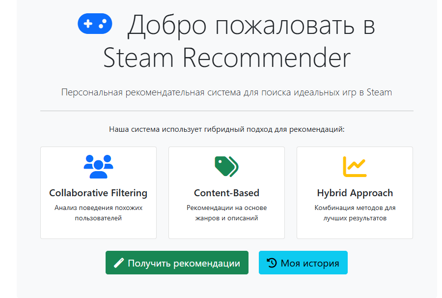
- **Коммит**: `chore: инициализация проекта с базовой структурой`

### Задание 1. Разработка ML сервиса (FastAPI)
- Реализован эндпоинт `/predict` для текстового поиска игр
- Реализован эндпоинт `/recommend-by-genres` для поиска по жанрам
- Реализован эндпоинт `/health` для проверки работоспособности
- Реализован эндпоинт `/model-info` для информации о модели
- Загружено 114 299 игр из Steam Dataset
- 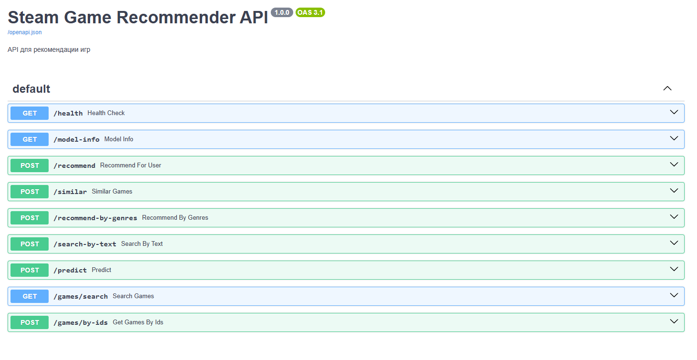
- **Коммит**: `feat(fastapi): добавлен ML сервис с поиском игр`

### Задание 2. Разработка веб-интерфейса (Flask)
- Реализована регистрация и аутентификация пользователей
- Реализована страница текстового поиска игр
- Реализована страница поиска по жанрам
- Реализована страница истории запросов
- Настроено взаимодействие с FastAPI через HTTP
- 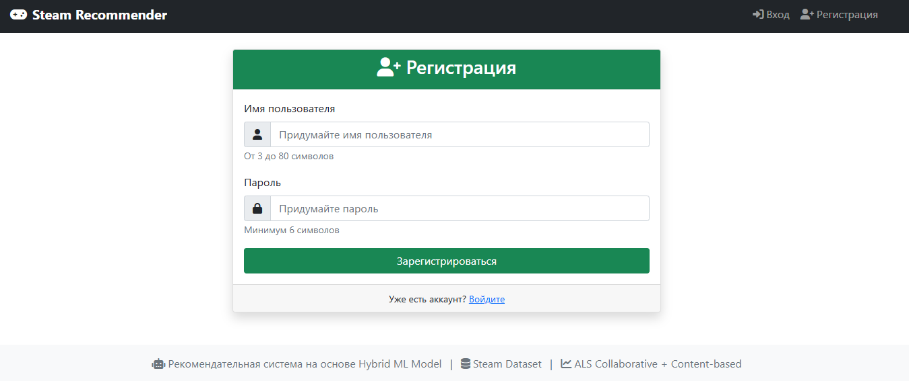
- 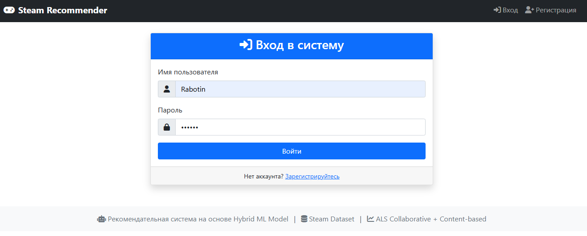
- **Коммит**: `feat(flask): добавлен веб-интерфейс с аутентификацией`

### Задание 3. Поиск и рекомендации
- Реализован текстовый поиск с переводом с русского на английский
- Реализован поиск по жанрам
- Результаты поиска с картинками и процентом совместимости
- Фильтрация 18+ контента
- 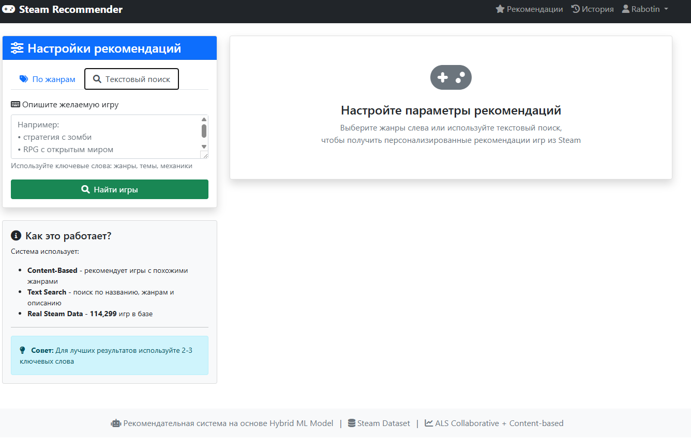
- 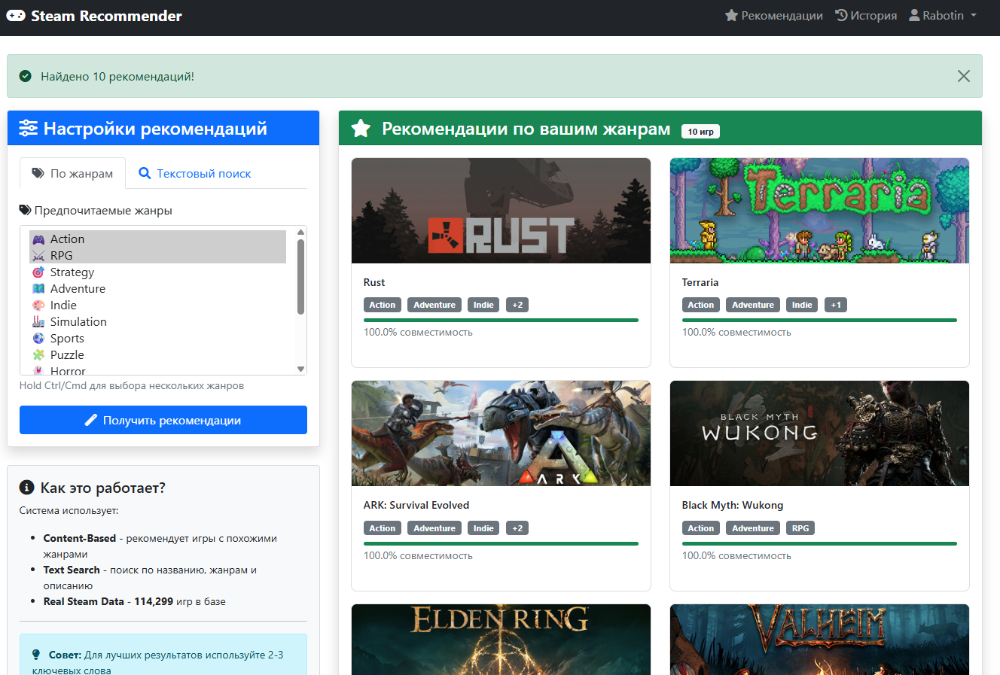
- **Коммит**: `feat: добавлен поиск игр с TF-IDF ранжированием`

### Задание 4. База данных и история
- Созданы модели User и RecommendationHistory (SQLAlchemy)
- Настроены Alembic миграции
- Сохранение истории запросов с названиями игр
- 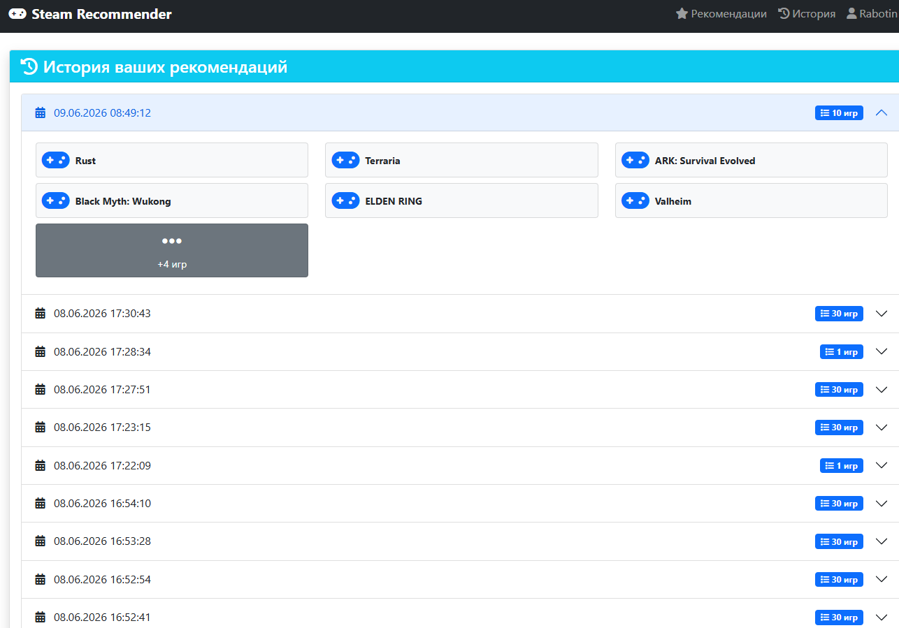
- **Коммит**: `feat(db): добавлены модели и Alembic миграции`

### Задание 5. Тестирование с pytest
- Созданы тесты для FastAPI эндпоинтов (`/health`, `/predict`, `/search-by-text`)
- Созданы тесты для Flask страниц (главная, логин, регистрация)
- Запущены тесты: `pytest tests/ -v`
- 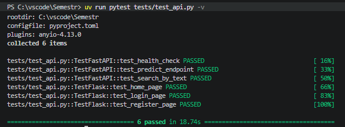
- **Коммит**: `test: добавлены pytest тесты для API`

### Задание 6. Контейнеризация с Docker
- Создан Dockerfile для FastAPI (многостадийная сборка с uv)
- Создан Dockerfile для Flask
- Создан docker-compose.yml с тремя сервисами: db, fastapi, flask
- Настроены тома для данных и модели
- 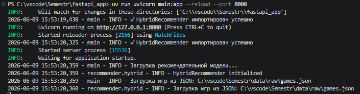
- 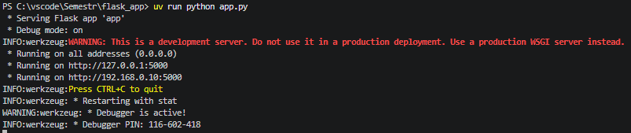
- **Коммит**: `docker: добавлена контейнеризация сервисов`

### Задание 7. Health check
- Добавлен эндпоинт `/health` для проверки состояния сервиса
- 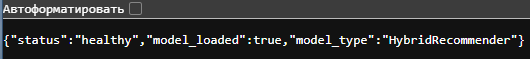
- **Коммит**: `feat: добавлен healthcheck эндпоинт`

## Инструкция по запуску

```bash
git clone https://github.com/Stallker-1/Rabotin-M.A.-steam-recommender.git
cd Rabotin-M.A.-steam-recommender
docker-compose up --build